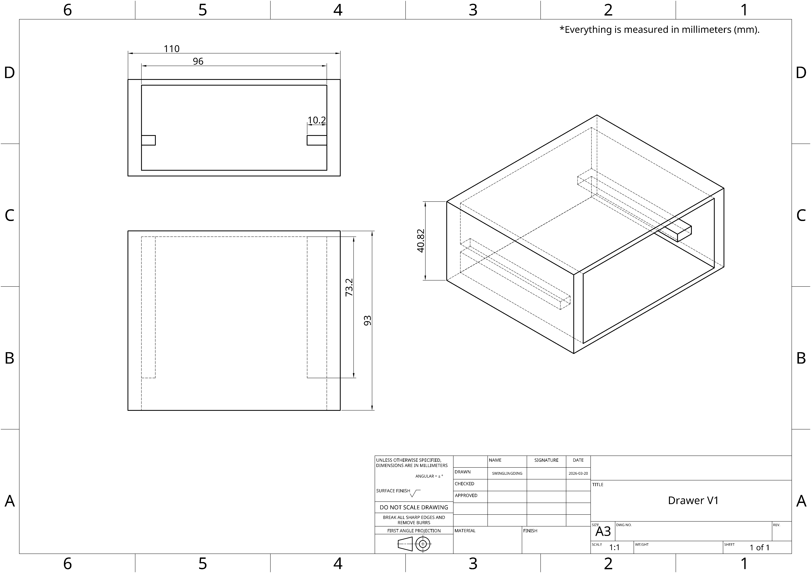
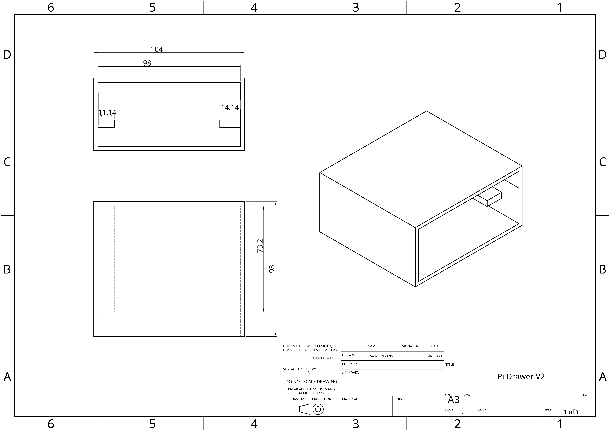
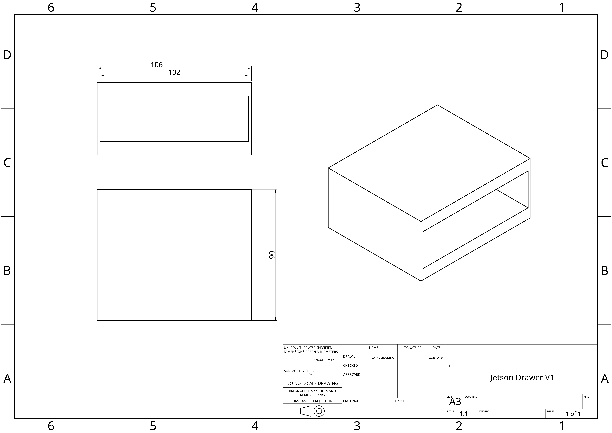
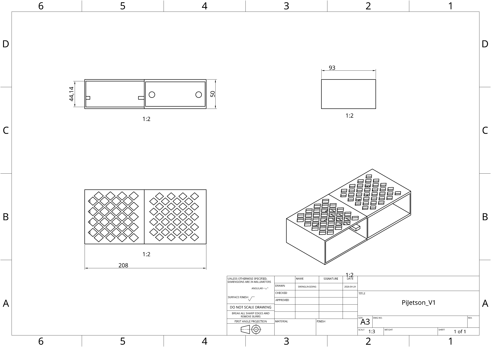

# Project L.U.C.I.A.

# Team

| Name | GitHub | Email |
|------|--------|-------|
| Christian Michael Villanueva | [@Chris4lyfie](https://github.com/Chris4lyfie) | christianmichael.villanueva@sjsu.edu |
| Ling Tang | [@ling-tang0922](https://github.com/ling-tang0922) | ling.tang@sjsu.edu |
| Ethanael Grimares | [@Memekushi](https://github.com/Memekushi) | ethanael.grimares@sjsu.edu |
| Noel Temores | [@noel-tem](https://github.com/noel-tem) | noel.temores@sjsu.edu |

**Advisor:** Professor Wencen Wu

# Project Description
LUCIA is an autonomous indoor robotic platform built on a repurposed iRobot Roomba 650. It uses a Raspberry Pi 5 as its main compute node, an RPLidar A2M8 for 2D SLAM and obstacle avoidance, and a ZED 2i stereo camera on a Jetson Nano for 3D depth perception and object detection. The system builds a real-time occupancy grid map of its environment while navigating autonomously, and is controlled via a browser-based web interface served directly from the Pi.

## Current Status
- **Roomba control** — fully operational via iRobot Open Interface serial commands
- **LiDAR obstacle avoidance** — reactive avoidance running with bump sensor recovery
- **SLAM** — 2D occupancy grid mapping via breezyslam, saves PNG map on exit
- **Web control panel** — FastAPI server auto-starts on boot, accessible at `http://10.42.0.1:8000`
- **ZED 2i on Jetson** — publishing RGB, odometry, and object detection over ROS2 Humble
- **ROS2 full stack** — in progress (Nav2 + slam_toolbox + roomba_bridge not yet wired up)

---

# Quick Start

## 1. Connect to LUCIA
Power on the Pi. The WiFi hotspot `lucia-control` (password: `lucia-143-tomato`) comes up automatically. Connect your laptop and open:
```
http://10.42.0.1:8000
```

## 2. Use the web panel
| Button | What it does |
|--------|-------------|
| **GO** | Start the robot (autonomous or manual) |
| **STOP** | Halt and return to waiting |
| **LIDAR ONLY** | Spin up LiDAR and view scan data without Roomba |
| **SYSTEM CHECK** | Check device connections and installed packages |
| **↺ RECONNECT** | Re-attempt hardware connections without restarting the server |
| **AUTO / MANUAL toggle** | Switch drive modes while running |

In **AUTO** mode the robot drives forward, avoids LiDAR obstacles, and recovers from physical bumps automatically. In **MANUAL** mode use WASD / arrow keys.

## 3. SSH access
```bash
ssh lucia@10.42.0.1   # password: lucia-143-tomato
```

---

# Prerequisites
- Linux Terminal

# Installation: Raspberry Pi Initial Setup: Wi-Fi AP + DHCP Server 

## Overview

This setup configures a Raspberry Pi to:

- Broadcast a WiFi network
- Assign IP addresses via DHCP
- Allow SSH access

## Network Configuration

| Component        | Value                  |
|------------------|------------------------|
| SSID             | lucia-control          |
| Password         | lucia-143-tomato       |
| Interface        | wlan0                  |
| Pi IP            | 10.42.0.1              |
| DHCP Range       | 10.42.0.10 – 10.42.0.100 |
| Subnet           | 255.255.255.0          |
| SSH Address      | 10.42.0.1              |

## Flash Raspberry Pi OS

Use Raspberry Pi Imager:

- Enable SSH
- Set username/password
- Set WLAN country

## Install Dependencies

sudo apt update
sudo apt install dnsmasq -y

## Create Access Point

sudo nmcli connection add type wifi ifname wlan0 con-name pi-ap ssid lucia-control

## Configure AP Mode

sudo nmcli connection modify pi-ap 802-11-wireless.mode ap
sudo nmcli connection modify pi-ap 802-11-wireless.band bg
sudo nmcli connection modify pi-ap 802-11-wireless.channel 6

## Configure Security

sudo nmcli connection modify pi-ap wifi-sec.key-mgmt wpa-psk
sudo nmcli connection modify pi-ap wifi-sec.psk "lucia-143-tomato"

## Configure Static IP

sudo nmcli connection modify pi-ap ipv4.addresses 10.42.0.1/24
sudo nmcli connection modify pi-ap ipv4.method manual
sudo nmcli connection modify pi-ap ipv4.never-default yes

## Bind to WiFi Interface

sudo nmcli connection modify pi-ap connection.interface-name wlan0

## Enable Auto-Start

sudo nmcli connection modify pi-ap connection.autoconnect yes

## Start Access Point

sudo nmcli connection up pi-ap

## Configure dnsmasq

/etc/dnsmasq.conf

interface=wlan0
bind-interfaces
port=0
dhcp-range=10.42.0.10,10.42.0.100,255.255.255.0,24h
dhcp-option=3,10.42.0.1
dhcp-option=6,10.42.0.1

## Start and Enable DHCP

sudo systemctl start dnsmasq
sudo systemctl enable dnsmasq

# Running the PoC: Roomba Serial Scripts

Python scripts for communicating with the Roomba 650 over serial using the iRobot Open Interface (OI).

---

## Overview

All scripts live in `src/scripts/` and communicate with the Roomba via USB-to-serial adapter at 115200 baud. They are built on a shared wrapper class (`roomba_oi.py`) so serial connection setup and opcode encoding is handled in one place.

**Dependencies:**
```
pip install pyserial pynput evdev
```

> `evdev` is Linux only and required for `drive_keyboard_linux.py` and `control_panel.py`.

**Port values:**
- Windows: `COM5` (check Device Manager if unsure)
- Linux: `/dev/ttyUSB0` (run `ls /dev/tty*` before and after plugging in to confirm)

**Virtual environment (Ubuntu/Linux):**
```bash
python3 -m venv ~/roomba-env
source ~/roomba-env/bin/activate
pip install pyserial evdev
```

**Permissions (Linux serial port):**
```bash
sudo usermod -aG dialout $USER   # then log out and back in
# or run once without the permanent fix:
sudo chmod 666 /dev/ttyUSB0
```

**Permissions (Linux input device for keyboard scripts):**
```bash
sudo usermod -aG input $USER   # then log out and back in
# or run with sudo
```

---

## Script Reference

### `roomba_oi.py` — OI Wrapper Library

Not run directly. Imported by all other scripts.

Wraps the iRobot Open Interface serial protocol into a Python class. Handles serial connection setup, byte encoding, mode switching, motion commands, and sensor reads. Automatically resets the Roomba on exit via the context manager.

**Key methods:**

| Method | Description |
|--------|-------------|
| `start()` | Enter OI passive mode. Always call first. |
| `full_mode()` | Enter full control mode. Safety stops disabled. |
| `safe_mode()` | Enter safe mode. Safety stops active. |
| `drive(velocity, radius)` | Drive with a single velocity and turning radius. |
| `drive_direct(left, right)` | Control each wheel independently. |
| `stop()` | Stop all wheel movement. |
| `reset()` | Soft reset the Roomba (opcode 7). Reboots the OI. |
| `seek_dock()` | Command Roomba to return to charging dock. |
| `display_text(text)` | Display up to 4 ASCII chars on the 7-segment display. |
| `read_bumps()` | Returns bump and wheel-drop sensor states. |
| `read_cliffs()` | Returns all four cliff sensor states. |
| `read_battery()` | Returns voltage, current, temp, charge %, etc. |
| `read_encoders()` | Returns raw left/right wheel encoder counts. |

**Usage pattern:**
```python
from roomba_oi import RoombaOI

with RoombaOI('/dev/ttyUSB0') as roomba:
    roomba.start()
    roomba.full_mode()
    roomba.drive(200, 32767)  # forward at 200 mm/s
```

The `with` block automatically stops and resets the Roomba, then closes the serial port on exit.

---

### `control_panel.py` — All-in-One Terminal Control Panel

The primary way to interact with the Roomba. Combines real-time drive control, live sensor monitoring, and hotkeys for all actions in a single terminal UI.

**Requirements:** `pip install evdev`

**Usage:**
```bash
# List available keyboard input devices
python3 control_panel.py --list-devices

# Run the control panel
python3 control_panel.py --port /dev/ttyUSB0 --device /dev/input/event3

# With sudo if not in input group
sudo ~/roomba-env/bin/python3 control_panel.py --port /dev/ttyUSB0 --device /dev/input/event3
```

**Arguments:**

| Argument | Default | Description |
|----------|---------|-------------|
| `--port` | `/dev/ttyUSB0` | Serial port |
| `--device` | auto-detect | Input device path (e.g. `/dev/input/event3`) |
| `--speed` | `300` | Drive speed in mm/s |
| `--list-devices` | — | Print available keyboard devices and exit |

**Drive controls:**

| Key(s) | Action |
|--------|--------|
| `W` / `↑` | Forward |
| `S` / `↓` | Backward |
| `A` / `←` | Spin left (CCW) |
| `D` / `→` | Spin right (CW) |
| `W + A` | Arc forward-left |
| `W + D` | Arc forward-right |
| `S + A` | Arc backward-left |
| `S + D` | Arc backward-right |

**Hotkeys:**

| Key | Action |
|-----|--------|
| `1` | Play Mass Destruction |
| `2` | Play La Cucaracha |
| `T` | Run square drive demo |
| `R` | Reset Roomba |
| `X` | Power off Roomba |
| `Q` / `ESC` | Quit |

---

### `test_led.py` — LED Display Test

Verifies the serial connection by displaying "LUCI" on the Roomba's 7-segment LED display for 5 seconds.

**Usage:**
```
python3 test_led.py --port /dev/ttyUSB0
```

**Arguments:**

| Argument | Default | Description |
|----------|---------|-------------|
| `--port` | `COM5` | Serial port |

**Use this first** when connecting to a new machine to confirm the serial link is working before running any drive scripts.

---

### `drive_keyboard_linux.py` — Real-Time Keyboard Control (Linux)

Hold keys to drive the Roomba in real time. Uses `evdev` to read directly from the input device — no display server or special permissions required beyond input group access. Supports combined key inputs for smooth arced movement.

**Requirements:** `pip install evdev`

**Usage:**
```bash
python3 drive_keyboard_linux.py --list-devices
python3 drive_keyboard_linux.py --port /dev/ttyUSB0 --device /dev/input/event3
```

**Arguments:**

| Argument | Default | Description |
|----------|---------|-------------|
| `--port` | `/dev/ttyUSB0` | Serial port |
| `--device` | auto-detect | Input device path |
| `--speed` | `300` | Base wheel speed in mm/s (50–500) |
| `--list-devices` | — | Print available keyboard devices and exit |

**Controls:** Same as control panel (W/A/S/D + arrow keys, Q/ESC to quit).

---

### `drive_keyboard_windows.py` — Real-Time Keyboard Control (Windows)

Same as the Linux version but uses `pynput` for key detection instead of `evdev`.

**Requirements:** `pip install pynput`

**Usage:**
```
python drive_keyboard_windows.py --port COM5
python drive_keyboard_windows.py --port COM5 --speed 400
```

**Arguments:**

| Argument | Default | Description |
|----------|---------|-------------|
| `--port` | `COM5` | Serial port |
| `--speed` | `300` | Base wheel speed in mm/s (50–500) |

---

### `drive_demos.py` — Automated Drive Patterns

Runs predefined autonomous movement patterns. Useful for validating drive commands and estimating odometry accuracy.

**Usage:**
```
python3 drive_demos.py --port /dev/ttyUSB0 --demo square
python3 drive_demos.py --port /dev/ttyUSB0 --demo figure_eight
```

**Arguments:**

| Argument | Default | Description |
|----------|---------|-------------|
| `--port` | `COM5` | Serial port |
| `--demo` | `square` | Pattern to run: `square` or `figure_eight` |

**Patterns:**

| Demo | Description |
|------|-------------|
| `square` | Four 600 mm legs with 90° left turns |
| `figure_eight` | Two 600 mm diameter circles in opposite directions |

**Note:** Movement accuracy is timing-based and approximate. Surface friction, battery level, and wheel slip all affect the result.

---

### `sensor_monitor.py` — Live Sensor Dashboard

Continuously polls and displays all major Roomba sensors in a refreshing terminal dashboard.

**Usage:**
```
python3 sensor_monitor.py --port /dev/ttyUSB0
python3 sensor_monitor.py --port /dev/ttyUSB0 --interval 0.25
```

**Arguments:**

| Argument | Default | Description |
|----------|---------|-------------|
| `--port` | `COM5` | Serial port |
| `--interval` | `0.5` | Poll interval in seconds |

**Displays:**

| Section | Data |
|---------|------|
| Bump Sensors | Left and right bump state |
| Wheel Drop | Left and right wheel drop state |
| Cliff Sensors | Left, front-left, front-right, right |
| Battery | Voltage (mV), current (mA), temperature (°C), charge (mAh / %) |
| Wheel Encoders | Raw left and right encoder counts (wraps at 65535) |

Press `Ctrl+C` to exit.

---

### `song.py` — Play Songs on the Roomba Speaker

Plays songs through the Roomba's built-in piezo speaker. Songs are defined as lists of (MIDI note, duration) tuples and loaded into the Roomba's song slots (max 16 notes per slot, 4 slots total).

**Usage:**
```
python3 song.py --port /dev/ttyUSB0 --song mass_destruction
python3 song.py --port /dev/ttyUSB0 --song la_cucaracha
```

**Arguments:**

| Argument | Default | Description |
|----------|---------|-------------|
| `--port` | `COM5` | Serial port |
| `--song` | `mass_destruction` | Song to play: `mass_destruction` or `la_cucaracha` |

---

### `reset.py` — Soft Reset

Sends opcode 7 to reboot the Roomba's OI. Equivalent to removing and reinserting the battery. The Roomba will return to passive mode after rebooting.

**Usage:**
```
python3 reset.py --port /dev/ttyUSB0
```

**Arguments:**

| Argument | Default | Description |
|----------|---------|-------------|
| `--port` | `COM5` | Serial port |

> Note: All scripts automatically reset the Roomba on exit via the `RoombaOI` context manager. Use this script only if you need a manual reset without running another script.

---

### `power_off.py` — Power Off

Powers down the Roomba using opcode 133. The Roomba will enter sleep mode and stop responding until the CLEAN button is pressed.

**Usage:**
```
python3 power_off.py --port /dev/ttyUSB0
```

**Arguments:**

| Argument | Default | Description |
|----------|---------|-------------|
| `--port` | `COM5` | Serial port |

---

---

## SLAM + Avoidance Scripts

These scripts live in `src/scripts/` and run directly on the Pi (no ROS required).

**Install dependencies:**
```bash
pip install rplidar-roboticia pyserial breezyslam Pillow fastapi "uvicorn[standard]"
```

---

### `obstacle_avoid.py` — Reactive LiDAR Obstacle Avoidance

Drives the Roomba forward autonomously and spins away from anything detected within `--safe-dist` in the forward arc. Runs in safe mode so cliff and wheel-drop sensors remain active.

```bash
python3 obstacle_avoid.py
python3 obstacle_avoid.py --roomba-port /dev/roomba --lidar-port /dev/rplidar
python3 obstacle_avoid.py --safe-dist 800 --speed 200 --log run.csv
```

| Argument | Default | Description |
|----------|---------|-------------|
| `--roomba-port` | `/dev/ttyUSB0` | Roomba serial port |
| `--lidar-port` | `/dev/ttyUSB1` | LiDAR serial port |
| `--speed` | `200` | Forward speed mm/s |
| `--safe-dist` | `600` | Stop threshold mm |
| `--fov` | `30` | Forward detection arc ±degrees |
| `--log` | off | CSV log output path |

---

### `slam_avoid.py` — SLAM + Obstacle Avoidance

Extends `obstacle_avoid.py` with real-time 2D occupancy grid mapping. Builds a map from LiDAR scans and dead-reckoning wheel encoder odometry. Saves a PNG map on Ctrl+C exit.

```bash
python3 slam_avoid.py
python3 slam_avoid.py --map-out session1.png --map-size 10 --map-pixels 800
```

Saves two files on exit:
- `map.png` — raw occupancy grid (white=free, black=obstacle, gray=unknown)
- `map_path.png` — same map with robot path overlaid (green=start, cyan=trail, red=end)

| Argument | Default | Description |
|----------|---------|-------------|
| `--map-out` | `map.png` | Output filename |
| `--map-size` | `10.0` | Map coverage in meters |
| `--map-pixels` | `500` | SLAM grid resolution |

---

### `slam_avoid_server.py` — Web Control Panel

The primary interface for operating LUCIA. Runs a FastAPI web server on the Pi and streams live sensor data to any browser on the same network. Installed as a systemd service so it starts automatically on boot.

**One-time install:**
```bash
cd src/scripts
bash install-service.sh
```

**After code changes:**
```bash
git pull && sudo systemctl restart lucia
```

**Useful service commands:**
```bash
sudo systemctl status lucia      # check if running
sudo systemctl restart lucia     # restart after code changes
journalctl -u lucia -f           # live logs
```

**Web panel features:**
- Live polar radar (LiDAR scan, colored by distance zone)
- SLAM occupancy map refreshing every 3 seconds
- AUTO mode: LiDAR obstacle avoidance + bump sensor recovery
- MANUAL mode: WASD keyboard drive with speed slider
- Left/Right bump indicators that light up on contact
- System check panel (device files, Python packages, runtime status)
- RECONNECT button to retry hardware without SSH

| Argument | Default | Description |
|----------|---------|-------------|
| `--roomba-port` | `/dev/ttyUSB0` | Roomba serial port |
| `--lidar-port` | `/dev/ttyUSB1` | LiDAR serial port |
| `--host` | `0.0.0.0` | Bind address |
| `--port` | `8000` | HTTP port |
| `--speed` | `200` | Auto forward speed mm/s |
| `--safe-dist` | `600` | LiDAR stop threshold mm |
| `--map-pixels` | `800` | SLAM grid resolution |
| `--map-size` | `10.0` | Map coverage in meters |

---

## udev Rules (Stable Device Names)

The scripts use `/dev/roomba` and `/dev/rplidar` as stable symlinks. Set them up once:

```bash
# With only the RPLidar plugged in:
udevadm info -a -n /dev/ttyUSB0 | grep -E 'serial|idVendor|idProduct' | head -10
# Note the serial value (e.g. "0001")

# With only the Roomba plugged in — repeat to get its serial
```

Edit `/etc/udev/rules.d/99-lucia.rules`:
```
SUBSYSTEM=="tty", ATTRS{idVendor}=="10c4", ATTRS{idProduct}=="ea60", ATTRS{serial}=="<rplidar_serial>", SYMLINK+="rplidar"
SUBSYSTEM=="tty", ATTRS{idVendor}=="10c4", ATTRS{idProduct}=="ea60", ATTRS{serial}=="<roomba_serial>",  SYMLINK+="roomba"
```

```bash
sudo udevadm control --reload
sudo udevadm trigger
ls -la /dev/roomba /dev/rplidar
```

Unplug and replug each device if the symlinks don't appear immediately.

---

## OI Mode Reference

All scripts use **Full Mode**.

| Mode | Opcode | Behavior |
|------|--------|----------|
| Passive | 128 | Read sensors only. No drive commands. |
| Safe | 131 | Drive commands work. Auto-stops on cliff/wheel-drop. |
| Full | 132 | Full control. No automatic safety stops. |

---

## Serial Command Structure

Drive commands encode velocity and radius as signed 16-bit big-endian integers.

**Example — drive forward at 200 mm/s:**
```
[137] [0, 200] [127, 255]
  ^      ^         ^
opcode  +200     32767 (straight)
```

**Example — spin left in place at 150 mm/s:**
```
[137] [0, 150] [0, 1]
  ^      ^       ^
opcode  +150   radius=1 (CCW spin)
```

`drive_direct` (opcode 145) sends right wheel velocity then left wheel velocity, each as a signed 16-bit big-endian integer.

---

## Troubleshooting

**`PermissionError: could not open port /dev/ttyUSB0`**
- Run `sudo chmod 666 /dev/ttyUSB0` for a one-time fix.
- Permanent fix: `sudo usermod -aG dialout $USER` then log out and back in.

**`serial.SerialException: could not open port`**
- Wrong port name. Check Device Manager (Windows) or `ls /dev/tty*` (Linux).
- Cable not plugged in, or driver not installed for the USB-serial adapter.

**Keyboard input not working in control panel or drive_keyboard_linux.py**
- Run with `sudo` or add yourself to the input group: `sudo usermod -aG input $USER`
- Use `--list-devices` to find the correct keyboard device path.
- The Logitech USB Receiver may appear before your actual keyboard — pick the one named `AT Translated Set 2 keyboard` or similar.

**Roomba does not move after connecting**
- Must call `start()` then `full_mode()` before any drive commands.
- Check battery level with `sensor_monitor.py`.
- Make sure the Roomba is not on its charging dock.

**Commands seem delayed or dropped**
- Two scripts cannot share one serial port simultaneously. Close any other running script first.

**`evdev` import error**
- Install it: `pip install evdev`
- If VSCode shows a warning, select the correct Python interpreter: `Ctrl+Shift+P` → `Python: Select Interpreter` → pick `roomba-env`.

# Demo
## 3/22 Demo


# CAD Drawings
## Pi Drawer V1 Drawing (March 27th)
 

## Pi Drawer V2 Drawing (April 18th)
 

## Jetson Drawer V1 Drawing (April 18th)
 

## Pi Jetson Drawer V1 Drawing (April 24th)
 

# Technical Stack
## Languages
Python, C, C++

## Algorithms
- Robot Operating System (ROS)
- Simultaneous Localization and Mapping (SLAM)
- You Only Look Once (YOLO)

## Hardware

| Component | Model | Role |
|-----------|-------|------|
| Compute (main) | Raspberry Pi 5 | Runs web server, SLAM, obstacle avoidance |
| Compute (vision) | Jetson Nano 4GB (eMMC) | Runs ZED SDK + ROS2 vision pipeline |
| Drive platform | iRobot Roomba 650 | Differential drive, bump/cliff sensors, encoders |
| LiDAR | RPLidar A2M8 | 2D 360° scan, 12 m range, 10 Hz |
| Stereo camera | ZED 2i | RGB + depth + IMU + object detection |
| Power (Pi) | 5A Raspberry Pi UPS | Battery-backed 5V supply with I2C fuel gauge |
| Storage | 256 GB microSD | Pi OS + repo |

# What's Next

## Immediate
- Complete Roomba udev rule (need to plug in Roomba and capture serial number)
- Full AUTO mode test with both Roomba and LiDAR connected
- Direct Ethernet link between Pi and Jetson (static IPs `192.168.1.1` / `192.168.1.2`)
- Confirm Pi can receive ZED topics from Jetson over ROS2

## ROS2 Stack
- Implement `roomba_bridge.py` — translate `/cmd_vel` to Roomba OI serial commands
- Configure `slam_toolbox` and `nav2` launch files
- Wire up ZED object detections as a Nav2 dynamic obstacle layer

## Future
- Full object detection and classification via YOLO on Jetson
- Target tracking — robot maintains a set following distance from a selected object
- Autonomous goal navigation using Nav2 global planner